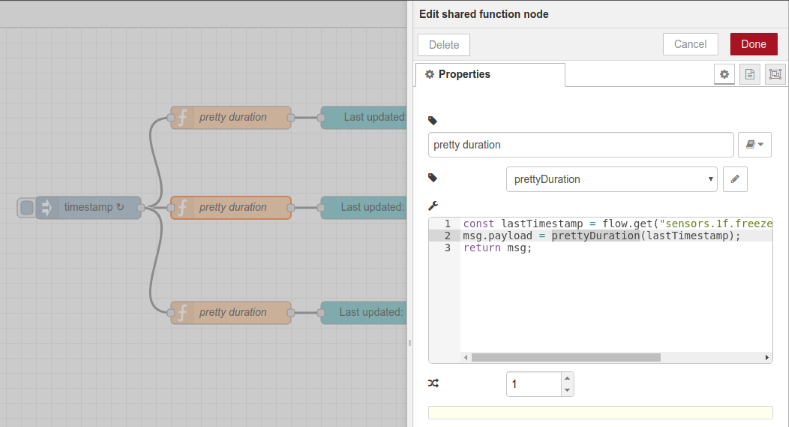
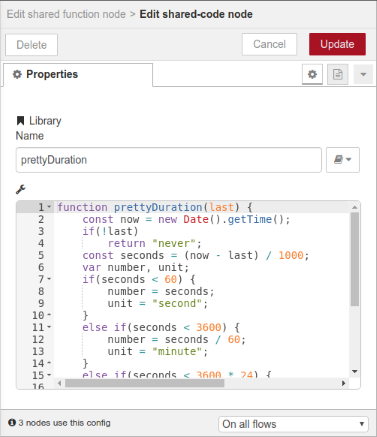

# node-red-contrib-shared-function

**This Node-RED node is just like the [core node "function"](http://nodered.org/docs/writing-functions.html), except that it lets you share code between function nodes by storing it in a configuration node.**

This should help you factor out proprietary logic onto regular Javascript functions which you can use from function nodes all over your flows.
Instead of copying and pasting your Javascript code across all the function nodes which might need it, you can just create one or more local libraries (stored within configuration nodes, i.e. within your flows) whose code will be included before your actual function code.

## Screenshots

Editing a shared function node containing a function that uses the shared `prettyDuration()` function:

Editing the shared `prettyDuration()` function, which is used by multiple shared function nodes:

